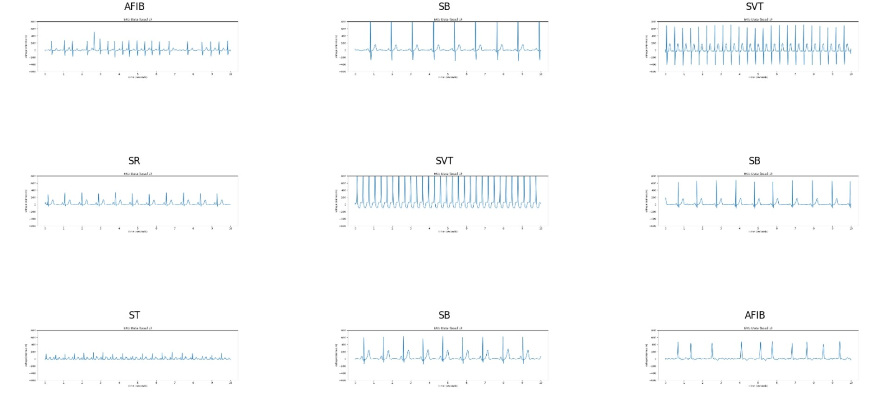
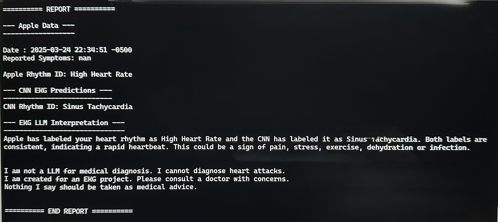

# **EKG Analysis with Deep Learning and Generative AI**

  
  &nbsp;&nbsp;&nbsp;&nbsp;&nbsp;&nbsp;&nbsp;
  
  &nbsp;&nbsp;&nbsp;&nbsp;&nbsp;&nbsp;&nbsp;
  
  &nbsp;&nbsp;&nbsp;&nbsp;&nbsp;&nbsp;&nbsp;
  

## About Me
I'm a Registered Nurse (RN) with experience in a variety of hospital settings since 2017, most recently in a Cardiac ICU. This project is an example of my curiosity about the intersection of healthcare and artificial intelligence. Having spent a significant portion of my AI ethics course exploring the ethical considerations of AI in health wearable devices, I was inspired to create a project that not only explores the technical aspects of AI but also adheres to key ethical principles.

## Project Overview
This project demonstrates a workflow for analyzing electrocardiogram (EKG or ECG) data from an Apple Watch.  
The project shows how to:
* Extract and process EKG data from an Apple Health export.zip file from the Apple Health app.
* Create a dataset of 10,000+ EKG images from the open-source 12-lead arrhythmia EKG dataset.
* Build, train, and evaluate a Convolutional Neural Network (CNN) to classify EKG rhythms using the created dataset of EKG images.
* Utilize a locally run Large Language Model (LLM) with a custom system prompt to interpret results.
* Generate an EKG report that combines the Apple Watch data, the CNN's predictions, and the LLM interpretation.

The goal is to provide an entry-level understanding of how to use data from Apple Watch wearable devices, apply deep learning concepts, and leverage generative AI in a responsible and ethical manner.
## **Disclaimer!**
**This is not a medical device.**  The information provided by this project is for **educational and informational purposes only** and should not be used for medical diagnosis or treatment. Always consult with a qualified healthcare professional for any health concerns or before making any decisions related to your health or treatment.  

#### Technologies Used
* **WSL/Ubuntu CLI** Where the project files were run and the **EKG report is generated**.
* **Python:** The primary programming language for this project.
* **TensorFlow/Keras:** For building and training the CNN model.
* **Pandas:** For data manipulation and analysis. 
* **Matplotlib:** For creating the EKG images from Apple Watch data and the open-sourced 12-lead EKG dataset for training the CNN.
* **Ollama:** For running the LLM locally and eliminating API calls for generative AI assistance on personal data. 

## Ethical Considerations
This project was designed with a strong emphasis on ethical AI principles for an AI ethics course.
* **Privacy:** By using a locally run LLM (Ollama) along with a locally trained CNN, all data processing and analysis happens on a local machine.  Apart from the Apple Health app and EKG app to obtain the data, no sensitive health data is sent to the cloud for further EKG insights.
* **Autonomy:** The project aims to empower Apple Watch users to be in control of their data and understand their personal health. This project seeks to distill the amazing capabilities of CNNs and LLMs to regular users at home to run locally and privately. The generated report has the potential (though not proven) ability to identify more heart rhythms than the Apple Watch currently does and may provide more information about the identified rhythm.  This project still routes users to their healthcare providers. 
* **Transparency:**
    * This project is open-source, with all code and notebooks available.
    * The notebooks provide explanations of how the dataset was created, how the CNN model was trained, how to export Apple Watch Health app data as an export.zip, and how to download a local LLM through Ollama and set the system prompt. 
    * Citations and links for the open-sourced dataset used. 
    * A clear disclaimer is included, stating that this project is not a medical device and should not be used for medical diagnosis. 
* **Decency and Non-Domination (inspired by Todd May's Decency Principle):** The project seeks to distill knowledge and empower individuals without being domineering. It provides information and analysis, but emphasizes that it is not a substitute for professional medical advice. The goal is to assist and educate, not to dictate or replace the role of a qualified healthcare professional.

## How it works
1. **Create an EKG image dataset:** (This is over 10,000+ images) using the open-source 12-lead EKG data cited.
    * create_ecg_csv_extract_lead_1.ipynb [create_csv_notebook](https://github.com/bretttay24/ekg_applewatch/blob/main/notebooks/create_ecg_csv_extract_lead_1.ipynb)
    * create_ecg_image_dataset.ipynb [create_images_notebook](https://github.com/bretttay24/ekg_applewatch/blob/main/notebooks/create_ecg_image_dataset.ipynb)

2. **Create/train/evaluate a local CNN:**  This will use the image datasets created above.
    * create_ekg_cnn.ipynb [create_cnn_notebook](https://github.com/bretttay24/ekg_applewatch/blob/main/notebooks/create_ekg_cnn.ipynb)
3. **Export Apple Health app data** This will create a large export.zip file.
    * appleData_export.ipynb [export_apple_health](https://github.com/bretttay24/ekg_applewatch/blob/main/notebooks/appleData_export.ipynb)
4. **Extract Data**([cnnfunctions.py](https://github.com/bretttay24/ekg_applewatch/blob/main/cnnfunctions.py))**:** The 'extract_ekg_and_data' function unzips the Apple Health export.zip file, finds the most recent EKG CSV file, and extracts the raw EKG values.
5. **Apple Watch EKG image creation**([cnnfunctions.py](https://github.com/bretttay24/ekg_applewatch/blob/main/cnnfunctions.py))**:**  The 'make_ekg_image' function takes the 30 seconds of EKG values and creates 3 separate 10-second EKG strip images which are saved as PNG files. 
6. **CNN Prediction**([cnnfunctions.py](https://github.com/bretttay24/ekg_applewatch/blob/main/cnnfunctions.py))**:** The 'CNNpredict_from_image' function loads the pre-trained Keras CNN model (created in step 2), preprocesses the EKG images, and predicts the heart rhythm for each of the 3 images. 
7. **Report Formatting**([cnnfunctions.py](https://github.com/bretttay24/ekg_applewatch/blob/main/cnnfunctions.py))**:** The 'format_report' function takes the Apple Watch data and the CNN's prediction and formats them into a readable report.
8. **LLM Interpretation**([cnnfunctions.py](https://github.com/bretttay24/ekg_applewatch/blob/main/cnnfunctions.py))**:** The 'get_llm_interpretation' function sends the formatted report to a locally running 'ekgllm' model and gets an interpretation of the results.
    * ollama.ipynb [ollama_notebook](https://github.com/bretttay24/ekg_applewatch/blob/main/notebooks/create_ollama_llm.ipynb)
9. **Main Script**([main.py](https://github.com/bretttay24/ekg_applewatch/blob/main/main.py))**:** The 'main.py' script ties it all together and orchestrates the entire workflow from data extraction to the final report generation (This file does not create the EKG dataset or create a CNN in steps 1 and 2)

#### To Run in the WSL/Ubuntu CLI Examples

"""
CLI:

*(virtual-env) wsluser@yoga:~/workspace/github.com/github_username/ekg_applewatch$ python3 main.py export1.zip

After the $ symbol you pass the arguments: "python3" "main.py" "your_apple_export.zip" (see example above)

"""

## Example 10 second EKG Images
#### Color

#### No Color

#### Example of Different Arrhythmias

## About My CNN Model Performance:
#### Training Accuracy

#### Training Loss

#### CNN Classification Report

#### CNN Confusion Matrix

### Example of CLI Generated Report 

### **Dataset Citation:**

* Zheng, Jianwei; Rakovski, Cyril; Danioko, Sidy; Zhang, Jianming; Yao, Hai; Hangyuan, Guo (2019). A 12-lead electrocardiogram database for arrhythmia research covering more than 10,000 patients. figshare. Collection. https://doi.org/10.6084/m9.figshare.c.4560497

* Zheng, Jianwei (2019). ECGDataDenoised.zip. figshare. Dataset. https://doi.org/10.6084/m9.figshare.8378291.v1

* Zheng, Jianwei (2019). Diagnostics.xlsx. figshare. Dataset. https://doi.org/10.6084/m9.figshare.8360408.v2

